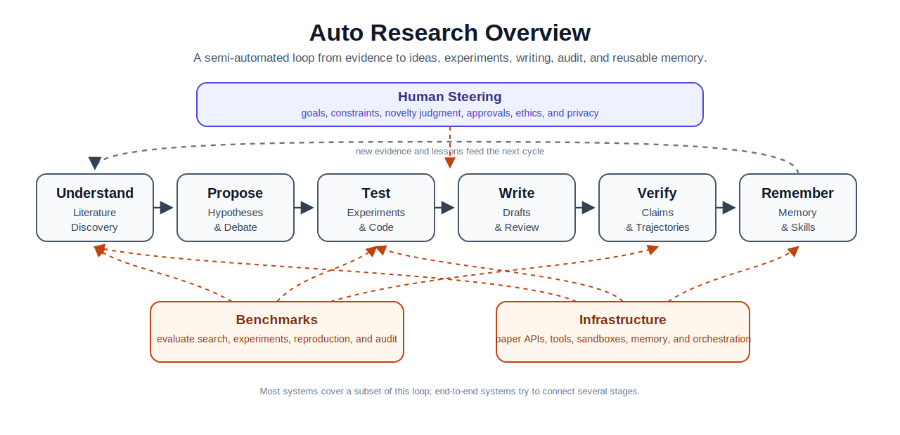

# Awesome Auto Research and AI Scientist Systems

[English](README.md) | [中文](README.zh-CN.md)

Last updated: 2026-06-13

A curated landscape of automated research, AI scientist systems, research agents, benchmarks, and infrastructure.

This list focuses on systems that can participate in research workflows: literature discovery, hypothesis generation, multi-agent discussion, experiment planning, code execution, result analysis, paper writing, review, and audit. It is a field map, not a leaderboard.

## Overview

Auto research can be understood as a research loop: understand the literature, propose hypotheses, test them, write results, verify claims, and preserve reusable knowledge. Most projects automate one or more parts of this loop rather than the entire process.



The sections below organize papers and projects by where they fit in this loop.

## Quick Start

- New to the area: start with [Overview](#overview), then [Field Map](#field-map) and [Reading Path](#reading-path).
- Looking for runnable code: scan the `open-source` rows in [Systems and Projects](#systems-and-projects).
- Looking for evaluation resources: go to [Benchmarks](#benchmarks).
- Choosing a system for your own workflow: see [How To Choose](#how-to-choose).
- Adding a new item: see [Contributing](#contributing).

## Contents

- [Legend](#legend)
- [Recent Additions](#recent-additions)
- [Field Map](#field-map)
- [Systems and Projects](#systems-and-projects)
- [Benchmarks](#benchmarks)
- [How To Choose](#how-to-choose)
- [Reading Path](#reading-path)
- [Other Lists and Surveys](#other-lists-and-surveys)
- [Contributing](#contributing)
- [License and Citation Notes](#license-and-citation-notes)

## Legend

| Tag | Meaning |
|:---|:---|
| `open-source` | Public code repository found. Check license before reuse. |
| `paper-only` | Paper exists, but no public implementation was found when added. |
| `project` | Public website, documentation, or hosted demo exists. |
| `product` | Hosted or commercial system; code may not be public. |
| `benchmark` | Dataset, environment, or evaluation protocol. |
| `infrastructure` | API, framework, reference manager, protocol, or reusable tooling. |
| `unverified` | Link, code status, license, or benchmark details need checking. |

`Stars` uses dynamic GitHub badges from shields.io. Values update automatically, but may be cached and should not be treated as a ranking metric.

## Recent Additions

| Date | Item | Links | Stars | Status | Why It Is Included |
| :---: | :--- | :--- | :---: | :--- | :--- |
| 2026-06 | SciAgentArena | [arXiv:2606.12736](https://arxiv.org/abs/2606.12736) | - | benchmark | Broad science-agent benchmark across scientific tasks and scales. |
| 2026-06 | Notes2Skills | [arXiv:2606.11897](https://arxiv.org/abs/2606.11897) | - | paper-only | Studies how research notes can become reusable agent skills. |
| 2026-06 | AI Coding Agents in Social Science | [arXiv:2606.11456](https://arxiv.org/abs/2606.11456) | - | empirical study | Evaluates coding agents in social-science analysis workflows. |
| 2026-06 | SocSci-Repro-Bench | [arXiv:2606.11447](https://arxiv.org/abs/2606.11447) | - | benchmark | Focuses on reproduction of social-science research. |
| 2026-06 | SciConBench | [arXiv:2606.11337](https://arxiv.org/abs/2606.11337) | - | benchmark | Clean-room benchmark for scientific conclusion synthesis. |
| 2026-06 | VirBench / gget-virus | [arXiv:2606.06749](https://arxiv.org/abs/2606.06749) | - | benchmark | Evaluates biomedical and virology-oriented agents with tool use. |
| 2026-06 | Search-Time Contamination in Deep Research Agents | [arXiv:2606.05241](https://arxiv.org/abs/2606.05241) | - | benchmark audit | Measures benchmark contamination risk when deep research agents search the web. |
| 2026-06 | TELBench / DRIFT | [arXiv:2606.02060](https://arxiv.org/abs/2606.02060), [code](https://github.com/NJU-LINK/DRIFT) | [](https://github.com/NJU-LINK/DRIFT) | benchmark, open-source | Evaluates trajectory-level error localization and claim support. |
| 2026-06 | EvoDS | [arXiv:2606.03841](https://arxiv.org/abs/2606.03841) | - | paper-only | Self-evolving data-science agent direction. |
| 2026-05 | AutoResearchClaw | [arXiv:2605.20025](https://arxiv.org/abs/2605.20025), [code](https://github.com/aiming-lab/AutoResearchClaw) | [](https://github.com/aiming-lab/AutoResearchClaw) | open-source | 23-stage research pipeline with HITL, debate, self-healing, and artifact tracking. |
| 2026-05 | Claw AI Lab | [arXiv:2605.22662](https://arxiv.org/abs/2605.22662), [OpenClaw](https://github.com/openclaw) | - | project | Agent-lab framing for research automation platforms. |
| 2026-05 | Expert Consulting Work Benchmark | [arXiv:2605.17554](https://arxiv.org/abs/2605.17554) | - | benchmark | Evaluates deep research agents on consulting-style analytical deliverables with rubrics and traps. |
| 2026-04 | AutoResearchBench | [arXiv:2604.25256](https://arxiv.org/abs/2604.25256), [code](https://github.com/CherYou/AutoResearchBench) | [](https://github.com/CherYou/AutoResearchBench) | benchmark, open-source | Evaluates scientific literature discovery with full-text evidence. |
| 2026-04 | BenchGuard | [arXiv:2604.24955](https://arxiv.org/abs/2604.24955) | - | paper-only | Studies benchmark contamination and benchmark-use risk. |
| 2026-04 | SeekerGym | [arXiv:2604.17143](https://arxiv.org/abs/2604.17143) | - | benchmark | Gym-style environment for information-seeking agents. |
| 2026-03 | EvoScientist | [arXiv:2603.08127](https://arxiv.org/abs/2603.08127), [code](https://github.com/EvoScientist/EvoScientist) | [](https://github.com/EvoScientist/EvoScientist) | open-source | Multi-agent self-evolving research buddy with persistent memory. |
| 2026-03 | OpenResearcher | [arXiv:2603.20278](https://arxiv.org/abs/2603.20278), [code](https://github.com/TIGER-AI-Lab/OpenResearcher) | [](https://github.com/TIGER-AI-Lab/OpenResearcher) | open-source | Training deep-research models from synthesized trajectories. |
| 2026-02 | MiroFlow | [arXiv:2602.22808](https://arxiv.org/abs/2602.22808) | - | paper-only | Deep-research flow and trajectory-based agent framework. |
| 2026-01 | TaxoBench | [arXiv:2601.12369](https://arxiv.org/abs/2601.12369), [code](https://github.com/KongLongGeFDU/TaxoBench) | [](https://github.com/KongLongGeFDU/TaxoBench) | benchmark, open-source | Evaluates whether deep research agents retrieve and organize papers like expert surveys. |
| 2026-01 | Rethinking AI Scientist | [arXiv:2601.12542](https://arxiv.org/abs/2601.12542) | - | paper-only | Interactive multi-agent workflow perspective. |

## Field Map

This map combines capability layers and common design paradigms. A single system may appear in several layers.

| Area | What It Covers | Typical Outputs | Representative Systems |
|:---|:---|:---|:---|
| Literature discovery | Search, retrieval, paper QA, source-grounded synthesis | evidence cards, related-work maps, cited reports | PaperQA2, OpenScholar, STORM, Open Deep Research |
| Hypothesis generation | Proposal generation, ranking, critique, evolution | candidate ideas, ranked hypotheses, research proposals | AI co-scientist, Robin, AI-Researcher |
| Multi-agent discussion | Specialist roles, debate, moderation, review | debate logs, review notes, decision records | Co-STORM, AutoResearchClaw, EvoScientist |
| Experiment planning | Datasets, baselines, metrics, ablations | experiment plans, run sheets, comparison tables | Agent Laboratory, AI Scientist v2, RD-Agent |
| Code and execution | Writing, running, debugging, and evaluating code | scripts, logs, metrics, plots | RD-Agent, AIDE, OpenHands, Aider |
| Writing and review | Drafting, reviewing, revising, figure/table support | paper drafts, reviews, revision notes | AI Scientist, Agent Laboratory, AutoResearchClaw |
| Verification and audit | Citation checks, claim support, trajectory diagnosis | claim ledgers, error spans, audit reports | DRIFT/TELBench, BenchGuard |
| Memory and skills | Persistent project memory and reusable skills | skills, notes, lessons learned, decision logs | Notes2Skills, EvoScientist, scientific-agent-skills |
| Domain agents | Domain tools, databases, and lab/data workflows | biomedical, chemistry, data-science workflows | ChemCrow, Biomni, Robin, EvoDS |

Common patterns:

| Pattern | Description | Examples |
|:---|:---|:---|
| Linear pipeline | Sequential stages from idea to paper. | AI Scientist, Agent Laboratory |
| Tree search / evolution | Candidate experiments or hypotheses evolve over time. | AI Scientist v2, AIDE, AlphaEvolve |
| Research council | Multiple specialist agents debate, rank, or revise proposals. | AI co-scientist, Co-STORM, AutoResearchClaw |
| Human-in-the-loop co-pilot | Humans approve plans, steer runs, and intervene at gates. | Agent Laboratory, AutoResearchClaw, EvoScientist |
| Deep research agent | Long-horizon search and synthesis over web or paper corpora. | PaperQA2, OpenScholar, Open Deep Research |
| Claim and trajectory audit | The system checks claims, sources, and error origins. | DRIFT/TELBench, AutoResearchClaw claim verification |
| Skill accumulation | Prior notes and failures become reusable skills. | Notes2Skills, EvoScientist |

## Systems and Projects

### End-to-End Research Automation

| System | Date | Links | Stars | Status | Scope | Main Pattern | HITL | Notes |
| :--- | :---: | :--- | :---: | :--- | :--- | :--- | :---: | :--- |
| The AI Scientist | 2024-08 | [paper](https://arxiv.org/abs/2408.06292), [code](https://github.com/SakanaAI/AI-Scientist) | [](https://github.com/SakanaAI/AI-Scientist) | open-source | ML paper generation | idea to experiment to paper | limited | Early full-cycle autonomous research pipeline. |
| The AI Scientist v2 | 2025-04 | [paper](https://arxiv.org/abs/2504.08066), [code](https://github.com/SakanaAI/AI-Scientist-v2) | [](https://github.com/SakanaAI/AI-Scientist-v2) | open-source | ML research | agentic tree search | limited | Moves away from fixed templates toward experiment-manager tree search. |
| Agent Laboratory | 2025-01 | [paper](https://arxiv.org/abs/2501.04227), [code](https://github.com/SamuelSchmidgall/AgentLaboratory) | [](https://github.com/SamuelSchmidgall/AgentLaboratory) | open-source | literature, experiments, writing | staged specialist-agent workflow | yes | Framed as a research assistant instead of a scientist replacement. |
| AgentRxiv | 2025-03 | [paper](https://arxiv.org/abs/2503.18102), [site](https://agentrxiv.github.io/) | - | project | cumulative agent research | shared archive | partial | Agents can upload, retrieve, and build on prior agent research. |
| AI-Researcher | 2025-05 | [paper](https://arxiv.org/abs/2505.18705), [code](https://github.com/HKUDS/AI-Researcher) | [](https://github.com/HKUDS/AI-Researcher) | open-source | literature to manuscript | autonomous innovation loop | partial | Supports detailed-idea and reference-only modes. |
| RD-Agent | 2025-05 | [paper](https://arxiv.org/abs/2505.14738), [code](https://github.com/microsoft/RD-Agent) | [](https://github.com/microsoft/RD-Agent) | open-source | data-centric R&D | research/development loop | yes | Focuses on implementation, evaluation, and feedback learning. |
| cmbagent | 2025-07 | [paper](https://arxiv.org/abs/2507.07257), [code](https://github.com/CMBAgents/cmbagent) | [](https://github.com/CMBAgents/cmbagent) | open-source | autonomous scientific discovery | planning and control multi-agent system | no | Open-source multi-agent system applied to cosmology research tasks. |
| AutoResearchClaw | 2026-05 | [paper](https://arxiv.org/abs/2605.20025), [code](https://github.com/aiming-lab/AutoResearchClaw) | [](https://github.com/aiming-lab/AutoResearchClaw) | open-source | idea to paper | staged pipeline, debate, self-healing | yes | Useful reference for co-pilot research automation and artifact discipline. |
| EvoScientist | 2026-03 | [paper](https://arxiv.org/abs/2603.08127), [code](https://github.com/EvoScientist/EvoScientist) | [](https://github.com/EvoScientist/EvoScientist) | open-source | research lifecycle | 6-agent team, persistent memory | yes | Emphasizes long sessions, human-on-the-loop control, and skills. |
| DeepScientist | 2026 | [code](https://github.com/ResearAI/DeepScientist) | [](https://github.com/ResearAI/DeepScientist) | open-source | local autonomous research | findings memory, experiment branching | yes | Local-first research studio with experiment branches and LaTeX drafts. |
| ResearStudio | 2025-10 | [paper](https://arxiv.org/abs/2510.12194), [code](https://github.com/ResearAI/ResearStudio) | [](https://github.com/ResearAI/ResearStudio) | open-source | research workspace | collaborative studio | yes | Useful product/workspace reference. |
| Claw AI Lab | 2026-05 | [paper](https://arxiv.org/abs/2605.22662), [project](https://github.com/openclaw) | - | project | AI research lab | agent-lab abstraction | yes | Relevant for platform-level orchestration. |
| Rethinking AI Scientist | 2026-01 | [paper](https://arxiv.org/abs/2601.12542) | - | paper-only | workflow design | interactive multi-agent workflow | yes | Useful perspective for moving beyond linear pipelines. |

### Research Councils, Debate, and Hypothesis Evolution

| System | Date | Links | Stars | Status | Focus | Mechanism | Notes |
| :--- | :---: | :--- | :---: | :--- | :--- | :--- | :--- |
| AI co-scientist | 2025-02 | [paper](https://arxiv.org/abs/2502.18864), [Google Research](https://research.google/blog/accelerating-scientific-breakthroughs-with-an-ai-co-scientist/) | - | project | hypothesis generation | generate, debate, evolve, tournament rank | Reference design for multi-agent research councils. |
| Robin | 2025-05 | [paper](https://arxiv.org/abs/2505.13400), [FutureHouse](https://www.futurehouse.org/) | - | project | therapeutic discovery | literature agents plus data-analysis agent | Lab-in-the-loop discovery workflow. |
| Co-STORM | 2024-08 | [paper](https://arxiv.org/abs/2408.15232), [code](https://github.com/stanford-oval/storm) | [](https://github.com/stanford-oval/storm) | open-source | collaborative knowledge curation | experts, moderator, mind map | Useful design for long multi-agent discussions with human steering. |
| STORM | 2024-02 | [paper](https://arxiv.org/abs/2402.14207), [code](https://github.com/stanford-oval/storm) | [](https://github.com/stanford-oval/storm) | open-source | pre-writing research | perspective-guided question asking | Helps produce outlines and source-grounded articles. |
| AutoResearchClaw Debate | 2026-05 | [paper](https://arxiv.org/abs/2605.20025), [code](https://github.com/aiming-lab/AutoResearchClaw) | [](https://github.com/aiming-lab/AutoResearchClaw) | open-source | hypothesis and review | structured multi-perspective debate | Includes intervention policies and debate artifacts. |
| EvoScientist Council | 2026-03 | [paper](https://arxiv.org/abs/2603.08127), [code](https://github.com/EvoScientist/EvoScientist) | [](https://github.com/EvoScientist/EvoScientist) | open-source | research buddy | planner, researcher, coder, debugger, analyst, writer | Useful reference for persistent multi-channel sessions. |

### Deep Research and Literature Discovery

| System | Date | Links | Stars | Status | Focus | Evidence Source | Notes |
| :--- | :---: | :--- | :---: | :--- | :--- | :--- | :--- |
| PaperQA2 | 2024-09 | [paper](https://arxiv.org/abs/2409.13740), [code](https://github.com/Future-House/paper-qa) | [](https://github.com/Future-House/paper-qa) | open-source | scientific RAG | full-text papers | Paper question answering with dynamic retrieval. |
| OpenScholar | 2024-11 | [paper](https://arxiv.org/abs/2411.14199), [code](https://github.com/AkariAsai/OpenScholar) | [](https://github.com/AkariAsai/OpenScholar) | open-source | scientific literature QA | open-access paper corpus | Retrieval-augmented LM over scientific corpora. |
| GPT Researcher | 2023-2026 | [code](https://github.com/assafelovic/gpt-researcher) | [](https://github.com/assafelovic/gpt-researcher) | open-source | web/local research reports | web and local docs | General deep-research baseline. |
| DeerFlow | 2025-2026 | [code](https://github.com/bytedance/deer-flow) | [](https://github.com/bytedance/deer-flow) | open-source | deep research and report generation | web, tools, sandbox | LangGraph-based open research agent framework. |
| Auto-Deep-Research | 2025 | [code](https://github.com/HKUDS/Auto-Deep-Research) | [](https://github.com/HKUDS/Auto-Deep-Research) | open-source | open deep research | web tools | Cost-aware open deep-research framework. |
| Open Deep Research | 2025 | [code](https://github.com/langchain-ai/open_deep_research) | [](https://github.com/langchain-ai/open_deep_research) | open-source | configurable deep research | search, MCP tools | Reference LangGraph implementation. |
| Tongyi DeepResearch | 2025-10 | [paper](https://arxiv.org/abs/2510.24701), [code](https://github.com/Alibaba-NLP/DeepResearch) | [](https://github.com/Alibaba-NLP/DeepResearch) | open-source | long-horizon information seeking | web search, sandbox | Deep information-seeking model/system line. |
| OpenResearcher | 2026-03 | [paper](https://arxiv.org/abs/2603.20278), [code](https://github.com/TIGER-AI-Lab/OpenResearcher) | [](https://github.com/TIGER-AI-Lab/OpenResearcher) | open-source | deep-research model training | synthetic trajectories | Training/evaluation pipeline for deep research models. |
| MiroFlow | 2026-02 | [paper](https://arxiv.org/abs/2602.22808) | - | paper-only | deep research flow | agent trajectories | Referenced by TELBench/DRIFT. Code status should be rechecked. |
| MiroEval | 2026-03 | [paper](https://arxiv.org/abs/2603.28407) | - | benchmark | deep research evaluation | Miro-style environment | Evaluation line for Miro-style agents. |
| MiroThinker | 2025-11 | [paper](https://arxiv.org/abs/2511.11793) | - | paper-only | deep research reasoning | research trajectories | Deep-research reasoning agent. Code status should be rechecked. |
| MiroThinker-1.7-H1 | 2026-03 | [paper](https://arxiv.org/abs/2603.15726) | - | paper-only | deep research reasoning | research trajectories | Updated MiroThinker variant. |
| Marco DeepResearch | 2026-03 | [paper](https://arxiv.org/abs/2603.28376) | - | paper-only | open deep research model | web research | Code/project status should be rechecked. |
| ResearchPilot | 2026-03 | [paper](https://arxiv.org/abs/2603.14629) | - | paper-only | research assistance | literature and reasoning | Research pilot agent concept. |
| Efficient Deep Research | 2025-12 | [paper](https://arxiv.org/abs/2512.13059) | - | paper-only | efficient deep research | web/retrieval | Relevant for budget-aware system design. |
| SeekerGym | 2026-04 | [paper](https://arxiv.org/abs/2604.17143) | - | benchmark | information-seeking agents | gym-style environment | Evaluates information seeking rather than complete research cycles. |

### Experiment, Coding, and R&D Agents

| System | Date | Links | Stars | Status | Focus | Main Mechanism | Notes |
| :--- | :---: | :--- | :---: | :--- | :--- | :--- | :--- |
| RD-Agent | 2025-05 | [paper](https://arxiv.org/abs/2505.14738), [code](https://github.com/microsoft/RD-Agent) | [](https://github.com/microsoft/RD-Agent) | open-source | data-centric R&D | R/D loop and feedback learning | Relevant for ML engineering, quant, Kaggle, and paper-to-code implementation. |
| AIDE | 2025-02 | [paper](https://arxiv.org/abs/2502.13138), [code](https://github.com/WecoAI/aideml) | [](https://github.com/WecoAI/aideml) | open-source | ML code exploration | agentic tree search | Useful experiment-search design reference. |
| AlphaEvolve | 2025-06 | [paper](https://arxiv.org/abs/2506.13131), [blog](https://deepmind.google/discover/blog/alphaevolve-a-gemini-powered-coding-agent-for-designing-advanced-algorithms/) | - | product/project | algorithm discovery | evolutionary code search | Non-paper example of research through code evolution. |
| DeepEvolve | 2025-10 | [paper](https://arxiv.org/abs/2510.06056) | - | paper-only | agentic code evolution | iterative program improvement | Relevant for scientific code improvement loops. |
| OpenHands | 2024-2026 | [code](https://github.com/All-Hands-AI/OpenHands) | [](https://github.com/All-Hands-AI/OpenHands) | open-source | software engineering | autonomous coding agent | Useful execution backend for research workflows. |
| Aider | 2023-2026 | [code](https://github.com/Aider-AI/aider) | [](https://github.com/Aider-AI/aider) | open-source | pair programming | git-aware code editing | Practical backend for paper-to-code and experiments. |
| SWE-agent | 2023-2026 | [code](https://github.com/SWE-agent/SWE-agent) | [](https://github.com/SWE-agent/SWE-agent) | open-source | issue fixing | terminal and file-editing agent | General coding-agent foundation. |
| AI Research Agents for ML | 2025-07 | [paper](https://arxiv.org/abs/2507.02554) | - | paper-only | ML engineering | MLE-bench analysis | Meta-analysis of research agents on ML tasks. |
| Prompt-Free Collaborative Agents for Paper Reproduction | 2025-12 | [paper](https://arxiv.org/abs/2512.02812) | - | paper-only | paper reproduction | collaborative agents | Relevant for automating reproduction from papers. |
| Executable Knowledge Graphs | 2025-10 | [paper](https://arxiv.org/abs/2510.17795) | - | paper-only | executable research knowledge | xKG | Turns papers into executable structures. |
| Notes2Skills | 2026-06 | [paper](https://arxiv.org/abs/2606.11897) | - | paper-only | notes to reusable skills | skill induction | Useful for long-term self-improving research agents. |

### Writing, Review, and Claim Audit

| System/Benchmark | Date | Links | Stars | Status | Unit | What It Handles | Notes |
| :--- | :---: | :--- | :---: | :--- | :--- | :--- | :--- |
| AI Scientist Reviewer | 2024-08 | [paper](https://arxiv.org/abs/2408.06292), [code](https://github.com/SakanaAI/AI-Scientist) | [](https://github.com/SakanaAI/AI-Scientist) | open-source | paper draft | LLM-generated paper review | Reviewer stage in AI Scientist. |
| Agent Laboratory Writing | 2025-01 | [paper](https://arxiv.org/abs/2501.04227), [code](https://github.com/SamuelSchmidgall/AgentLaboratory) | [](https://github.com/SamuelSchmidgall/AgentLaboratory) | open-source | research report | writing from literature and experiments | Produces reports from staged workflows. |
| AutoResearchClaw Co-Writer | 2026-05 | [paper](https://arxiv.org/abs/2605.20025), [code](https://github.com/aiming-lab/AutoResearchClaw) | [](https://github.com/aiming-lab/AutoResearchClaw) | open-source | paper draft | drafting, review, claim verification | Includes peer review, quality gates, and citation checks. |
| TELBench / DRIFT | 2026-06 | [paper](https://arxiv.org/abs/2606.02060), [code](https://github.com/NJU-LINK/DRIFT) | [](https://github.com/NJU-LINK/DRIFT) | benchmark, open-source | semantic span | first harmful error and unsupported claims | Process-level audit benchmark and diagnostic framework. |
| BenchGuard | 2026-04 | [paper](https://arxiv.org/abs/2604.24955) | - | paper-only | benchmark use | contamination and misuse | Useful for benchmark trustworthiness analysis. |
| PaperBanana | 2025 | [code](https://github.com/dwzhu-pku/PaperBanana) | [](https://github.com/dwzhu-pku/PaperBanana) | open-source | figure/illustration | publication-quality diagrams | Multi-agent framework for academic illustrations. |
| ChatPaper | 2023 | [code](https://github.com/kaixindelele/ChatPaper) | [](https://github.com/kaixindelele/ChatPaper) | open-source | paper summary | paper reading and review | Earlier paper-reading assistant. |
| ChatReviewer | 2023 | [code](https://github.com/nishiwen1214/ChatReviewer) | [](https://github.com/nishiwen1214/ChatReviewer) | open-source | review/response | paper review and response | Companion project to ChatPaper. |

### Domain-Specific AI Scientists

| System | Date | Links | Stars | Status | Domain | Research Loop | Notes |
| :--- | :---: | :--- | :---: | :--- | :--- | :--- | :--- |
| Robin | 2025-05 | [paper](https://arxiv.org/abs/2505.13400), [FutureHouse](https://www.futurehouse.org/) | - | project | therapeutics | literature to lab result analysis | Lab-in-the-loop discovery workflow. |
| AI co-scientist | 2025-02 | [paper](https://arxiv.org/abs/2502.18864), [Google Research](https://research.google/blog/accelerating-scientific-breakthroughs-with-an-ai-co-scientist/) | - | project | biomedicine | hypothesis tournament to validation | Scientist-in-the-loop hypothesis system. |
| Biomni | 2025 | [code](https://github.com/snap-stanford/Biomni) | [](https://github.com/snap-stanford/Biomni) | open-source | biomedicine | tool-using biomedical agent | General-purpose biomedical AI agent. |
| ChemCrow | 2023-04 | [paper](https://arxiv.org/abs/2304.05376), [code](https://github.com/ur-whitelab/chemcrow-public) | [](https://github.com/ur-whitelab/chemcrow-public) | open-source | chemistry | LLM plus chemistry tools | Early chemistry tool-using agent. |
| Coscientist | 2023-12 | [Nature](https://www.nature.com/articles/s41586-023-06792-0) | - | paper-only | chemistry | autonomous chemical research | Prototype closed or non-public system. |
| Aleks | 2025-08 | [paper](https://arxiv.org/abs/2508.19383) | - | paper-only | plant science | multi-agent discovery | Domain-specific scientific discovery agent. |
| QuarkMedSearch | 2026-04 | [paper](https://arxiv.org/abs/2604.12867) | - | paper-only | medicine | medical deep search | Medical literature search design reference. |
| K-Dense Analyst | 2025-08 | [paper](https://arxiv.org/abs/2508.07043) | - | paper-only | biomedical/data science | analyst-style scientific work | Relevant for scientific data-analysis agents. |
| SR-Scientist | 2025-10 | [paper](https://arxiv.org/abs/2510.11661) | - | paper-only | scientific equation discovery | agentic code/data loop | Agentic system for symbolic scientific equation discovery. |
| EvoDS | 2026-06 | [paper](https://arxiv.org/abs/2606.03841) | - | paper-only | data science | self-evolving data-science agent | Domain-specific self-evolving agent. |
| AI Coding Agents in Social Science | 2026-06 | [paper](https://arxiv.org/abs/2606.11456) | - | paper-only | social science | coding-agent empirical study | Studies methodological diversity and interpretive vulnerability in social-science analysis. |
| VirBench / gget-virus | 2026-06 | [paper](https://arxiv.org/abs/2606.06749) | - | benchmark | virology/bioinformatics | tool and reasoning tasks | Tests biomedical tool use. |
| BioVeil MATRIX | 2026-05 | [paper](https://arxiv.org/abs/2605.00927) | - | benchmark | biomedicine | biomedical reasoning tasks | Biomedical evaluation setting. |
| SocSci-Repro-Bench | 2026-06 | [paper](https://arxiv.org/abs/2606.11447) | - | benchmark | social science | reproduction tasks | Reproducibility-focused social-science benchmark. |

### Infrastructure

| Resource | Date | Link | Stars | Status | Use |
| :--- | :---: | :--- | :---: | :--- | :--- |
| scientific-agent-skills | 2025-2026 | [K-Dense-AI/scientific-agent-skills](https://github.com/K-Dense-AI/scientific-agent-skills) | [](https://github.com/K-Dense-AI/scientific-agent-skills) | open-source | Scientific skills for coding agents. |
| AI-Research-SKILLs | 2025-2026 | [Orchestra-Research/AI-research-SKILLs](https://github.com/Orchestra-Research/AI-research-SKILLs) | [](https://github.com/Orchestra-Research/AI-research-SKILLs) | open-source | Research lifecycle skills for coding agents. |
| OpenClaw Medical Skills | 2026 | [FreedomIntelligence/OpenClaw-Medical-Skills](https://github.com/FreedomIntelligence/OpenClaw-Medical-Skills) | [](https://github.com/FreedomIntelligence/OpenClaw-Medical-Skills) | open-source | Medical and biomedical tool skills. |
| OpenAlex | ongoing | [OpenAlex](https://openalex.org/) | - | infrastructure | Literature graph and metadata. |
| Semantic Scholar API | ongoing | [Semantic Scholar API](https://www.semanticscholar.org/product/api) | - | infrastructure | Paper metadata, citations, and abstracts. |
| arXiv API | ongoing | [arXiv API](https://info.arxiv.org/help/api/index.html) | - | infrastructure | Preprint discovery. |
| PubMed | ongoing | [PubMed](https://pubmed.ncbi.nlm.nih.gov/) | - | infrastructure | Biomedical literature search. |
| Crossref | ongoing | [Crossref](https://www.crossref.org/) | - | infrastructure | DOI and citation metadata. |
| Zotero | ongoing | [Zotero](https://www.zotero.org/) | - | infrastructure | Reference management and local literature library. |
| Obsidian | ongoing | [Obsidian](https://obsidian.md/) | - | infrastructure | Local notes and research memory. |
| LiteLLM | ongoing | [LiteLLM](https://github.com/BerriAI/litellm) | [](https://github.com/BerriAI/litellm) | infrastructure | Multi-provider model routing. |
| LangGraph | ongoing | [LangGraph](https://github.com/langchain-ai/langgraph) | [](https://github.com/langchain-ai/langgraph) | infrastructure | Stateful agent graphs. |
| DSPy | ongoing | [DSPy](https://github.com/stanfordnlp/dspy) | [](https://github.com/stanfordnlp/dspy) | infrastructure | Structured LM pipelines. |
| MCP | ongoing | [Model Context Protocol](https://modelcontextprotocol.io/) | - | infrastructure | Tool and data integration. |

### Commercial and Closed-Source References

These are included as product or design references, not as open-source baselines.

| System | Date | Link | Status | Scope | Notes |
|:---|:---:|:---|:---|:---|:---|
| OpenAI Deep Research | 2025-02 | [announcement](https://openai.com/index/introducing-deep-research/) | product | multi-step web research | Product reference for long-horizon cited reports. |
| Gemini Deep Research | 2024-2026 | [Gemini](https://gemini.google.com/) | product | deep research reports | Product reference for interactive research. |
| FutureHouse Platform | 2024-2026 | [FutureHouse](https://www.futurehouse.org/) | product/project | scientific agents | Includes literature and scientific discovery agents. |
| Elicit | ongoing | [Elicit](https://elicit.com/) | product | literature review | Product reference for evidence-grounded literature review. |
| Consensus | ongoing | [Consensus](https://consensus.app/) | product | evidence search | Product reference for scientific claim search. |
| Perplexity | ongoing | [Perplexity](https://www.perplexity.ai/) | product | cited answer engine | Baseline for cited web research. |
| NotebookLM | ongoing | [NotebookLM](https://notebooklm.google/) | product | document-grounded research | Source-grounded document and note assistant. |

## Benchmarks

Benchmark entries are grouped by what they evaluate. Literature discovery, deep-research reports, code execution, paper reproduction, and trajectory audit should not be treated as the same task.

### Benchmark Map

| Benchmark | Date | Links | Stars | Primary Capability | Task Type | Evidence / Environment | Metric Style | Suitable For | Caveat |
| :--- | :---: | :--- | :---: | :--- | :--- | :--- | :--- | :--- | :--- |
| AutoResearchBench | 2026-04 | [paper](https://arxiv.org/abs/2604.25256), [code](https://github.com/CherYou/AutoResearchBench) | [](https://github.com/CherYou/AutoResearchBench) | literature discovery | deep and wide search | full-text academic corpus | accuracy, IoU | scientific paper search | not a full research lifecycle benchmark |
| TaxoBench | 2026-01 | [paper](https://arxiv.org/abs/2601.12369), [code](https://github.com/KongLongGeFDU/TaxoBench) | [](https://github.com/KongLongGeFDU/TaxoBench) | survey synthesis | retrieval and taxonomy organization | expert taxonomy trees from surveys | recall, clustering/structure metrics | evaluating survey-style deep research | focused on survey organization |
| SciConBench | 2026-06 | [paper](https://arxiv.org/abs/2606.11337) | - | scientific conclusion synthesis | open-domain scientific conclusions | systematic reviews, clean-room web harness | factual precision/recall/F1 | scientific synthesis agents | health/science conclusion focused |
| Search-Time Contamination | 2026-06 | [paper](https://arxiv.org/abs/2606.05241) | - | benchmark integrity | contamination detection | public benchmarks plus web search | contamination rates, performance inflation | evaluating deep-research benchmark validity | audit paper, not task benchmark |
| TELBench / DRIFT | 2026-06 | [paper](https://arxiv.org/abs/2606.02060), [code](https://github.com/NJU-LINK/DRIFT) | [](https://github.com/NJU-LINK/DRIFT) | trajectory diagnosis | error localization | agent trajectories | F1, first-error accuracy | process audit | not a final-answer benchmark |
| ResearchClawBench | 2026 | [project](https://github.com/InternScience/ResearchClawBench) | [](https://github.com/InternScience/ResearchClawBench) | autonomous research workflow | agent-mode research tasks | research-agent environment | leaderboard | workflow comparison | task definitions should be inspected |
| DeepResearch Bench | 2025-06 | [paper](https://arxiv.org/abs/2506.11763) | - | deep research reports | search and synthesis | web/research tasks | rubric/evaluation | report generation | may not test experiments |
| DeepResearch Bench II | 2026-01 | [paper](https://arxiv.org/abs/2601.08536) | - | deep research reports | long-horizon research | web/research tasks | rubric/evaluation | deep research comparison | live rankings can age quickly |
| FutureSearch Deep Research Bench | 2025-06 | [paper](https://arxiv.org/abs/2506.06287) | - | future-oriented deep research | forecasting/research | web and reports | rubric | report quality and reasoning | not experiment execution |
| Expert Consulting Work Benchmark | 2026-05 | [paper](https://arxiv.org/abs/2605.17554) | - | deep research deliverables | consulting-style analytical tasks | SME-authored prompts, verifiers, rubrics | VRS, verifier pass, rubric score | decision-grade deep research reports | consulting domain emphasis |
| DRBench | 2025-10 | [paper](https://arxiv.org/abs/2510.00172) | - | enterprise deep research | business/research tasks | enterprise-style tasks | human/LLM eval | product-style deep research | domain-specific |
| LiveResearchBench | 2025-10 | [paper](https://arxiv.org/abs/2510.14240) | - | live deep research | time-sensitive research | live/updated tasks | benchmark scores | current-event robustness | results age quickly |
| MiroEval | 2026-03 | [paper](https://arxiv.org/abs/2603.28407) | - | deep research agent evaluation | trajectory/report tasks | Miro-style environment | multiple metrics | deep-research models | ecosystem assumptions should be checked |
| AstaBench | 2025-10 | [paper](https://arxiv.org/abs/2510.21652) | - | scientific code/data tasks | code execution, data analysis | scientific task environment | task success | scientific tool use | not full paper writing |
| MLE-bench | 2024-10 | [paper](https://arxiv.org/abs/2410.07095), [code](https://github.com/openai/mle-bench) | [](https://github.com/openai/mle-bench) | ML engineering | Kaggle-style competitions | code and datasets | medal/rank style | experiment/code agents | ML engineering only |
| ScienceAgentBench | 2024-10 | [paper](https://arxiv.org/abs/2410.05080) | - | data-driven scientific discovery | scientific tasks | datasets/tools | task success | science-agent capabilities | domain coverage matters |
| MLRC-Bench | 2025-04 | [paper](https://arxiv.org/abs/2504.09702) | - | ML research capability | research challenge | ML tasks | benchmark scores | ML research agents | inspect ground truth carefully |
| PaperBench | 2025-04 | [paper](https://arxiv.org/abs/2504.01848) | - | paper reproduction | reproduce ML papers | code and papers | reproduction success | paper-to-code workflows | expensive to run |
| RE-Bench | 2024-11 | [paper](https://arxiv.org/abs/2411.15114) | - | research engineering | engineering tasks | realistic R&D tasks | task success | R&D automation | not literature-centered |
| BixBench | 2025-03 | [paper](https://arxiv.org/abs/2503.00096) | - | computational biology agents | biology tasks | biological data/tools | task success | biology research agents | domain-specific |
| SciAgentArena | 2026-06 | [paper](https://arxiv.org/abs/2606.12736) | - | science agents across scales | scientific tasks | multi-scale science tasks | benchmark scores | broad science-agent comparison | new protocol should be validated |
| SocSci-Repro-Bench | 2026-06 | [paper](https://arxiv.org/abs/2606.11447) | - | social-science reproduction | reproduction tasks | papers, data, analysis | reproduction success | reproducibility agents | social-science focused |
| VirBench | 2026-06 | [paper](https://arxiv.org/abs/2606.06749) | - | virology/bioinformatics agents | tool and reasoning tasks | gget-virus | task success | biomedical agents | domain-specific |
| BioVeil MATRIX | 2026-05 | [paper](https://arxiv.org/abs/2605.00927) | - | biomedical reasoning | biomedical tasks | curated biomedical setting | task success | biomedical agent evaluation | domain-specific |

### Coverage Matrix

Legend: `Y` = primary focus, `P` = partial/secondary coverage, `-` = not the main target.

| Benchmark | Literature | Deep Report | Code/Experiment | Reproduction | Process Audit | Domain Science | Live/Updated |
|:---|:---:|:---:|:---:|:---:|:---:|:---:|:---:|
| AutoResearchBench | Y | P | - | - | P | P | - |
| TaxoBench | Y | Y | - | - | P | P | - |
| SciConBench | P | Y | - | - | P | Y | Y |
| Search-Time Contamination | P | P | - | - | Y | P | P |
| TELBench / DRIFT | - | P | - | - | Y | - | - |
| ResearchClawBench | P | P | Y | P | P | P | - |
| DeepResearch Bench | P | Y | - | - | P | P | P |
| DeepResearch Bench II | P | Y | - | - | P | P | P |
| Expert Consulting Work Benchmark | P | Y | - | - | P | P | - |
| LiveResearchBench | P | Y | - | - | P | P | Y |
| MiroEval | P | Y | - | - | P | P | P |
| AstaBench | - | - | Y | P | - | Y | - |
| MLE-bench | - | - | Y | - | - | P | - |
| ScienceAgentBench | P | - | Y | P | - | Y | - |
| PaperBench | P | - | Y | Y | - | P | - |
| RE-Bench | - | - | Y | P | - | P | - |
| SciAgentArena | P | P | P | P | P | Y | P |
| SocSci-Repro-Bench | P | - | Y | Y | - | Y | - |
| VirBench | P | - | Y | P | - | Y | - |

### How To Compare Benchmarks

- Ask what research stage the benchmark tests: literature, experiment, writing, reproduction, or audit.
- Check what evidence the agent can access: abstracts, full papers, web pages, code, raw data, or trajectories.
- Check the environment type: static corpus, live web, sandboxed code, domain data, or simulated workflow.
- Check the metric: exact match, IoU, F1, rubric score, rank, reproduction success, or human judgment.
- Check whether the benchmark exposes failure traces, not only final scores.
- Check cost realism: tokens, tool calls, compute, wall time, and failed runs.
- Avoid presenting one benchmark as the universal benchmark for auto research.

## How To Choose

Choose by research job and autonomy level, not by star count alone.

| Goal | Systems To Inspect First | Why These Are Relevant |
|:---|:---|:---|
| Build a personal research co-pilot | EvoScientist, Agent Laboratory, AutoResearchClaw, DeepScientist | They expose long sessions, human steering, and intermediate artifacts. |
| Generate and debate hypotheses | AI co-scientist, Robin, Co-STORM, AutoResearchClaw | They use multi-agent discussion, ranking, or hypothesis evolution. |
| Run ML experiments and code loops | RD-Agent, AI Scientist v2, AIDE, OpenHands, Aider | They focus on implementation, debugging, metrics, and iteration. |
| Do literature discovery | PaperQA2, OpenScholar, AutoResearchBench-style tools, STORM | They emphasize source-grounded retrieval and paper evidence. |
| Produce a paper draft | AI Scientist, Agent Laboratory, AutoResearchClaw | They include writing, figures, references, and review stages. |
| Audit research-agent reliability | DRIFT/TELBench, AutoResearchClaw claim verification, BenchGuard | They inspect unsupported claims, traces, or benchmark risks. |
| Work in biomedicine or chemistry | Robin, AI co-scientist, Biomni, ChemCrow, Coscientist | They include domain tools, scientific databases, or lab-in-the-loop validation. |
| Build a private local workflow | DeepScientist, local-deep-research style tools, Zotero/Obsidian plus coding agents | They are better suited to unpublished ideas and local files. |

Selection checklist:

- Does it support your research stage: literature, hypothesis, experiment, writing, audit?
- Does it expose intermediate artifacts, or only final reports?
- Can multiple agents search independently, debate, or critique each other?
- Can a human approve plans and intervene during the run?
- Does it preserve long-term memory, failed attempts, and lessons learned?
- Does it execute code in a sandbox or clearly separated environment?
- Does it verify citations, claims, numeric results, and figure/table references?
- Does it record negative results and failed runs?
- Does it support your domain's tools, data formats, and privacy constraints?
- Can the final result be rerun from saved artifacts?

## Reading Path

One possible order:

1. [AI co-scientist](https://arxiv.org/abs/2502.18864) for multi-agent hypothesis generation.
2. [AI Scientist v2](https://arxiv.org/abs/2504.08066) for experiment tree search.
3. [Agent Laboratory](https://arxiv.org/abs/2501.04227) for staged assistant workflows.
4. [AutoResearchClaw](https://arxiv.org/abs/2605.20025) for HITL, debate, and artifact discipline.
5. [EvoScientist](https://arxiv.org/abs/2603.08127) for persistent multi-agent research sessions.
6. [AutoResearchBench](https://arxiv.org/abs/2604.25256) for literature-discovery evaluation.
7. [DRIFT/TELBench](https://arxiv.org/abs/2606.02060) for process-level error localization.
8. [Notes2Skills](https://arxiv.org/abs/2606.11897) for turning research experience into reusable skills.

## Other Lists and Surveys

| Resource | Date | Link | Stars | Type | Why Read It |
| :--- | :---: | :--- | :---: | :--- | :--- |
| Deep Research Survey | 2025-08 | [arXiv:2508.12752](https://arxiv.org/abs/2508.12752) | - | survey | Broad overview of deep research agents. |
| From AI for Science to Agentic Science | 2025-08 | [arXiv:2508.14111](https://arxiv.org/abs/2508.14111) | - | survey | Domain-oriented survey of autonomous scientific discovery. |
| Awesome Deep Research | 2025-2026 | [DavidZWZ/Awesome-Deep-Research](https://github.com/DavidZWZ/Awesome-Deep-Research) | [](https://github.com/DavidZWZ/Awesome-Deep-Research) | list | Deep research systems and benchmarks. |
| Awesome AutoResearch | 2025-2026 | [alvinreal/awesome-autoresearch](https://github.com/alvinreal/awesome-autoresearch) | [](https://github.com/alvinreal/awesome-autoresearch) | list | Auto-research systems and loops. |
| Awesome AI for Science | ongoing | [ai-boost/awesome-ai-for-science](https://github.com/ai-boost/awesome-ai-for-science) | [](https://github.com/ai-boost/awesome-ai-for-science) | list | Broad AI-for-science resources. |

<!-- ## Contributing

Inclusion is not endorsement. Notes summarize the apparent scope of each project from public sources and should be updated when code, papers, or benchmark protocols change.

Included:

- systems that automate or assist at least one scientific-research stage;
- agent frameworks with research workflows, memory, tools, code execution, or paper-writing support;
- benchmarks that evaluate literature discovery, deep research, experiment/code execution, process reliability, or paper reproduction;
- domain-specific AI scientist systems in biology, chemistry, medicine, ML, data science, finance, or related fields;
- infrastructure that is commonly useful for building research agents.

Usually excluded:

- generic chatbots with no research workflow;
- simple summarizers without retrieval, citations, or audit;
- unsourced lists without stable links;
- projects whose relation to research automation is unclear.

Maintenance principles:

- Prefer primary sources: arXiv, OpenReview, PMLR, ACL Anthology, CVF, ACM, IEEE, Nature, official project pages, and GitHub repos.
- Avoid universal ranking claims; tie performance claims to a specific benchmark and date.
- Separate open-source projects, paper-only systems, benchmarks, infrastructure, and commercial products.
- Record limitations and verification status when a repo, license, benchmark protocol, or result is unclear.

Suggested entry format:

```markdown
| Name | Date | Links | Status | Scope | Main Pattern | HITL | Notes |
```

Contribution checklist:

- include the first public date or release month;
- include paper link when available;
- include code or project link when available;
- mark status as `open-source`, `paper-only`, `project`, `product`, `benchmark`, `infrastructure`, or `unverified`;
- identify the research stage and main paradigm;
- include a caveat if benchmark scope, license, code availability, or results are unclear;
- avoid unsupported ranking claims;
- prefer primary sources over blog summaries or secondary lists.

Recommended PR structure:

```markdown
### What changed
- Added/updated: <name>
- Category: <system / benchmark / infrastructure / product>
- Date verified: YYYY-MM-DD

### Sources
- Paper:
- Code/project:
- Benchmark/docs:

### Caveats
- License:
- Code availability:
- Benchmark scope:
```

Open questions and useful future contributions:

- code availability checks for paper-only systems such as MiroFlow, MiroThinker, Marco DeepResearch, ResearchPilot, and Efficient Deep Research;
- license and maintenance-status checks for open-source repos;
- clearer separation between systems that can run locally and hosted products;
- cost/runtime columns for benchmarks and systems;
- privacy and data-governance notes for unpublished manuscripts and lab data;
- more domain coverage outside ML, biomedicine, chemistry, and data science;
- benchmarks that support human-in-the-loop workflows rather than only full autonomy;
- reproducibility notes for systems that generate papers, figures, or experimental claims;
- negative-result and failure-trace examples from real agent runs.

## License and Citation Notes

Check each project's own license before using code, datasets, or benchmarks. This repository only curates links and short summaries. Paper metadata, benchmark descriptions, and result claims should be attributed to their original sources. -->
