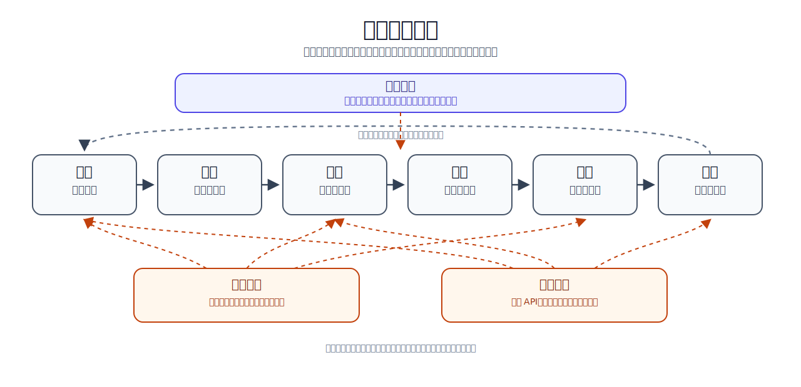

# Awesome Auto Research and AI Scientist Systems

[English](README.md) | [中文](README.zh-CN.md)

最后更新：2026-06-13

本仓库系统整理自动科研（Auto Research）、AI Scientist 系统、科研智能体、基准评测与基础设施资源。

这里关注的不是一般意义上的聊天机器人，而是能够参与科研流程的系统：文献发现、假设生成、多智能体讨论、实验设计、代码执行、结果分析、论文写作、同行评审与过程审计。本列表旨在提供领域地图，而不是排行榜。

## 概览

自动科研可以理解为一个循环过程：理解已有文献，提出研究假设，设计并执行实验，撰写研究结果，核验声明与证据，并将经验沉淀为可复用的记忆与技能。多数系统只自动化其中一部分环节；端到端系统则尝试连接多个阶段。



下面的目录按照系统在该循环中的功能位置进行组织。

## 快速开始

- 如果你刚接触该方向：建议先阅读 [概览](#概览)、[领域地图](#领域地图) 与 [阅读路径](#阅读路径)。
- 如果你主要寻找可运行代码：优先查看 [系统与项目](#系统与项目) 中标记为 `open-source` 的条目。
- 如果你关注评测资源：直接阅读 [基准评测](#基准评测)。
- 如果你想为自己的科研流程选择工具：参考 [如何选择系统](#如何选择系统)。
- 如果你希望补充新论文或新项目：参考 [贡献指南](#贡献指南)。

## 目录

- [标签说明](#标签说明)
- [近期新增](#近期新增)
- [领域地图](#领域地图)
- [系统与项目](#系统与项目)
- [基准评测](#基准评测)
- [如何选择系统](#如何选择系统)
- [阅读路径](#阅读路径)
- [相关列表与综述](#相关列表与综述)
- [贡献指南](#贡献指南)
- [许可与引用说明](#许可与引用说明)

## 标签说明

| 标签 | 含义 |
|:---|:---|
| `open-source` | 已找到公开代码仓库。复用前仍需检查许可证。 |
| `paper-only` | 已有论文，但加入列表时未找到公开实现。 |
| `project` | 存在公开网页、文档或在线演示。 |
| `product` | 托管式或商业系统，代码通常不公开。 |
| `benchmark` | 数据集、环境或评测协议。 |
| `infrastructure` | API、框架、文献管理器、协议或可复用工具。 |
| `unverified` | 链接、代码状态、许可证或评测细节仍需核验。 |

`Stars` 列使用 shields.io 的 GitHub 动态徽章。数值会自动更新，但可能存在缓存，不应被视为排名指标。

## 近期新增

| 日期 | 条目 | 链接 | Stars | 状态 | 收录原因 |
| :---: | :--- | :--- | :---: | :--- | :--- |
| 2026-06 | SciAgentArena | [arXiv:2606.12736](https://arxiv.org/abs/2606.12736) | - | benchmark | 面向多尺度科学任务的通用科学智能体评测。 |
| 2026-06 | Notes2Skills | [arXiv:2606.11897](https://arxiv.org/abs/2606.11897) | - | paper-only | 研究如何将实验或科研笔记转化为可复用的智能体技能。 |
| 2026-06 | AI Coding Agents in Social Science | [arXiv:2606.11456](https://arxiv.org/abs/2606.11456) | - | empirical study | 评估编码智能体在社会科学分析工作流中的表现。 |
| 2026-06 | SocSci-Repro-Bench | [arXiv:2606.11447](https://arxiv.org/abs/2606.11447) | - | benchmark | 面向社会科学研究复现的评测基准。 |
| 2026-06 | SciConBench | [arXiv:2606.11337](https://arxiv.org/abs/2606.11337) | - | benchmark | 面向科学结论综合的 clean-room 基准。 |
| 2026-06 | VirBench / gget-virus | [arXiv:2606.06749](https://arxiv.org/abs/2606.06749) | - | benchmark | 评估生物医学和病毒学场景下智能体的工具使用能力。 |
| 2026-06 | Search-Time Contamination in Deep Research Agents | [arXiv:2606.05241](https://arxiv.org/abs/2606.05241) | - | benchmark audit | 分析深度研究智能体在网页搜索中造成的基准污染风险。 |
| 2026-06 | TELBench / DRIFT | [arXiv:2606.02060](https://arxiv.org/abs/2606.02060), [code](https://github.com/NJU-LINK/DRIFT) | [](https://github.com/NJU-LINK/DRIFT) | benchmark, open-source | 评估轨迹级错误定位与声明支持关系。 |
| 2026-06 | EvoDS | [arXiv:2606.03841](https://arxiv.org/abs/2606.03841) | - | paper-only | 面向数据科学任务的自演化智能体方向。 |
| 2026-05 | AutoResearchClaw | [arXiv:2605.20025](https://arxiv.org/abs/2605.20025), [code](https://github.com/aiming-lab/AutoResearchClaw) | [](https://github.com/aiming-lab/AutoResearchClaw) | open-source | 23 阶段科研流水线，包含 HITL、辩论、自修复与产物追踪。 |
| 2026-05 | Claw AI Lab | [arXiv:2605.22662](https://arxiv.org/abs/2605.22662), [OpenClaw](https://github.com/openclaw) | - | project | 将自动科研组织为智能体实验室与平台化流程。 |
| 2026-05 | Expert Consulting Work Benchmark | [arXiv:2605.17554](https://arxiv.org/abs/2605.17554) | - | benchmark | 在咨询式分析交付物、rubric 和陷阱任务上评估深度研究智能体。 |
| 2026-04 | AutoResearchBench | [arXiv:2604.25256](https://arxiv.org/abs/2604.25256), [code](https://github.com/CherYou/AutoResearchBench) | [](https://github.com/CherYou/AutoResearchBench) | benchmark, open-source | 基于全文证据评估科学文献发现能力。 |
| 2026-04 | BenchGuard | [arXiv:2604.24955](https://arxiv.org/abs/2604.24955) | - | paper-only | 研究基准污染与基准使用风险。 |
| 2026-04 | SeekerGym | [arXiv:2604.17143](https://arxiv.org/abs/2604.17143) | - | benchmark | 面向信息搜索智能体的 gym 风格环境。 |
| 2026-03 | EvoScientist | [arXiv:2603.08127](https://arxiv.org/abs/2603.08127), [code](https://github.com/EvoScientist/EvoScientist) | [](https://github.com/EvoScientist/EvoScientist) | open-source | 具备持久记忆的多智能体自演化科研助手。 |
| 2026-03 | OpenResearcher | [arXiv:2603.20278](https://arxiv.org/abs/2603.20278), [code](https://github.com/TIGER-AI-Lab/OpenResearcher) | [](https://github.com/TIGER-AI-Lab/OpenResearcher) | open-source | 使用合成轨迹训练深度研究模型。 |
| 2026-02 | MiroFlow | [arXiv:2602.22808](https://arxiv.org/abs/2602.22808) | - | paper-only | 面向深度研究流程与轨迹建模的智能体框架。 |
| 2026-01 | TaxoBench | [arXiv:2601.12369](https://arxiv.org/abs/2601.12369), [code](https://github.com/KongLongGeFDU/TaxoBench) | [](https://github.com/KongLongGeFDU/TaxoBench) | benchmark, open-source | 评估深度研究智能体是否能像专家综述一样检索并组织论文。 |
| 2026-01 | Rethinking AI Scientist | [arXiv:2601.12542](https://arxiv.org/abs/2601.12542) | - | paper-only | 从交互式多智能体工作流角度重新讨论 AI Scientist。 |

## 领域地图

该图谱综合了自动科研系统的能力层次与常见设计范式。同一系统可能同时覆盖多个环节。

| 方向 | 覆盖内容 | 典型输出 | 代表系统 |
|:---|:---|:---|:---|
| 文献发现 | 检索、论文问答、证据驱动综合 | 证据卡片、相关工作地图、带引用报告 | PaperQA2, OpenScholar, STORM, Open Deep Research |
| 假设生成 | 研究想法生成、排序、批判与演化 | 候选 idea、排序后的假设、研究计划 | AI co-scientist, Robin, AI-Researcher |
| 多智能体讨论 | 专家角色、辩论、主持、评审 | 辩论日志、评审意见、决策记录 | Co-STORM, AutoResearchClaw, EvoScientist |
| 实验设计 | 数据集、基线、指标、消融实验 | 实验计划、运行表、对比表 | Agent Laboratory, AI Scientist v2, RD-Agent |
| 代码与执行 | 编写、运行、调试与评估代码 | 脚本、日志、指标、图表 | RD-Agent, AIDE, OpenHands, Aider |
| 写作与评审 | 草稿撰写、审稿、修改、图表支持 | 论文草稿、评审意见、修改记录 | AI Scientist, Agent Laboratory, AutoResearchClaw |
| 验证与审计 | 引用检查、声明支持、轨迹诊断 | claim ledger、错误 span、审计报告 | DRIFT/TELBench, BenchGuard |
| 记忆与技能 | 持久项目记忆与可复用技能 | 技能、笔记、经验、决策日志 | Notes2Skills, EvoScientist, scientific-agent-skills |
| 领域智能体 | 领域工具、数据库、实验室或数据工作流 | 生医、化学、数据科学等领域流程 | ChemCrow, Biomni, Robin, EvoDS |

常见范式：

| 范式 | 描述 | 示例 |
|:---|:---|:---|
| 线性流水线 | 按照从 idea 到论文的顺序推进。 | AI Scientist, Agent Laboratory |
| 树搜索 / 演化 | 多个实验或假设候选随时间演化。 | AI Scientist v2, AIDE, AlphaEvolve |
| 研究委员会 | 多个专家智能体进行辩论、排序或修订。 | AI co-scientist, Co-STORM, AutoResearchClaw |
| 人在环路协作 | 人类在关键节点审批、干预和引导。 | Agent Laboratory, AutoResearchClaw, EvoScientist |
| 深度研究智能体 | 面向网页或论文语料的长程检索与综合。 | PaperQA2, OpenScholar, Open Deep Research |
| 声明与轨迹审计 | 检查科研声明、证据来源与错误起点。 | DRIFT/TELBench, AutoResearchClaw claim verification |
| 技能沉淀 | 将已有笔记、失败经验与流程转化为可复用技能。 | Notes2Skills, EvoScientist |

## 系统与项目

### 端到端科研自动化

| 系统 | 日期 | 链接 | Stars | 状态 | 范围 | 主要范式 | HITL | 说明 |
| :--- | :---: | :--- | :---: | :--- | :--- | :--- | :---: | :--- |
| The AI Scientist | 2024-08 | [paper](https://arxiv.org/abs/2408.06292), [code](https://github.com/SakanaAI/AI-Scientist) | [](https://github.com/SakanaAI/AI-Scientist) | open-source | ML 论文生成 | idea 到实验再到论文 | limited | 早期完整自动科研流水线。 |
| The AI Scientist v2 | 2025-04 | [paper](https://arxiv.org/abs/2504.08066), [code](https://github.com/SakanaAI/AI-Scientist-v2) | [](https://github.com/SakanaAI/AI-Scientist-v2) | open-source | ML 科研 | agentic tree search | limited | 从固定模板转向实验管理器式树搜索。 |
| Agent Laboratory | 2025-01 | [paper](https://arxiv.org/abs/2501.04227), [code](https://github.com/SamuelSchmidgall/AgentLaboratory) | [](https://github.com/SamuelSchmidgall/AgentLaboratory) | open-source | 文献、实验、写作 | 分阶段专家智能体流程 | yes | 定位为科研助手，而不是替代科学家。 |
| AgentRxiv | 2025-03 | [paper](https://arxiv.org/abs/2503.18102), [site](https://agentrxiv.github.io/) | - | project | 累积式智能体研究 | 共享研究档案 | partial | 智能体可上传、检索并复用其他智能体研究。 |
| AI-Researcher | 2025-05 | [paper](https://arxiv.org/abs/2505.18705), [code](https://github.com/HKUDS/AI-Researcher) | [](https://github.com/HKUDS/AI-Researcher) | open-source | 文献到论文 | 自主科学创新循环 | partial | 支持详细 idea 模式与 reference-only 模式。 |
| RD-Agent | 2025-05 | [paper](https://arxiv.org/abs/2505.14738), [code](https://github.com/microsoft/RD-Agent) | [](https://github.com/microsoft/RD-Agent) | open-source | 数据中心 R&D | Research/Development 循环 | yes | 侧重实现、评估与反馈学习。 |
| cmbagent | 2025-07 | [paper](https://arxiv.org/abs/2507.07257), [code](https://github.com/CMBAgents/cmbagent) | [](https://github.com/CMBAgents/cmbagent) | open-source | 自主科学发现 | 规划与控制型多智能体系统 | no | 应用于宇宙学研究任务的开源多智能体系统。 |
| AutoResearchClaw | 2026-05 | [paper](https://arxiv.org/abs/2605.20025), [code](https://github.com/aiming-lab/AutoResearchClaw) | [](https://github.com/aiming-lab/AutoResearchClaw) | open-source | idea 到论文 | 阶段流水线、辩论、自修复 | yes | 可作为协同式自动科研与产物纪律的参考。 |
| EvoScientist | 2026-03 | [paper](https://arxiv.org/abs/2603.08127), [code](https://github.com/EvoScientist/EvoScientist) | [](https://github.com/EvoScientist/EvoScientist) | open-source | 科研生命周期 | 六智能体团队、持久记忆 | yes | 强调长会话、人类在环路控制与技能机制。 |
| DeepScientist | 2026 | [code](https://github.com/ResearAI/DeepScientist) | [](https://github.com/ResearAI/DeepScientist) | open-source | 本地自主科研 | findings memory、实验分支 | yes | 本地优先的研究工作室，支持实验分支和 LaTeX 草稿。 |
| ResearStudio | 2025-10 | [paper](https://arxiv.org/abs/2510.12194), [code](https://github.com/ResearAI/ResearStudio) | [](https://github.com/ResearAI/ResearStudio) | open-source | 科研工作空间 | 协作式研究工作室 | yes | 可作为产品形态与工作空间设计参考。 |
| Claw AI Lab | 2026-05 | [paper](https://arxiv.org/abs/2605.22662), [project](https://github.com/openclaw) | - | project | AI 科研实验室 | agent-lab 抽象 | yes | 与平台级编排和智能体实验室架构相关。 |
| Rethinking AI Scientist | 2026-01 | [paper](https://arxiv.org/abs/2601.12542) | - | paper-only | 工作流设计 | 交互式多智能体工作流 | yes | 对突破线性自动化流水线有参考价值。 |

### 研究委员会、辩论与假设演化

| 系统 | 日期 | 链接 | Stars | 状态 | 重点 | 机制 | 说明 |
| :--- | :---: | :--- | :---: | :--- | :--- | :--- | :--- |
| AI co-scientist | 2025-02 | [paper](https://arxiv.org/abs/2502.18864), [Google Research](https://research.google/blog/accelerating-scientific-breakthroughs-with-an-ai-co-scientist/) | - | project | 假设生成 | 生成、辩论、演化、锦标赛排序 | 多智能体科研委员会的代表性设计。 |
| Robin | 2025-05 | [paper](https://arxiv.org/abs/2505.13400), [FutureHouse](https://www.futurehouse.org/) | - | project | 治疗发现 | 文献智能体与数据分析智能体协作 | 实验室在环路的发现流程。 |
| Co-STORM | 2024-08 | [paper](https://arxiv.org/abs/2408.15232), [code](https://github.com/stanford-oval/storm) | [](https://github.com/stanford-oval/storm) | open-source | 协作式知识整理 | 专家、主持人、mind map | 适合参考长程多智能体讨论与人类引导。 |
| STORM | 2024-02 | [paper](https://arxiv.org/abs/2402.14207), [code](https://github.com/stanford-oval/storm) | [](https://github.com/stanford-oval/storm) | open-source | 写作前研究 | perspective-guided question asking | 帮助生成大纲和证据驱动文章。 |
| AutoResearchClaw Debate | 2026-05 | [paper](https://arxiv.org/abs/2605.20025), [code](https://github.com/aiming-lab/AutoResearchClaw) | [](https://github.com/aiming-lab/AutoResearchClaw) | open-source | 假设与评审 | 结构化多视角辩论 | 包含干预策略与辩论产物。 |
| EvoScientist Council | 2026-03 | [paper](https://arxiv.org/abs/2603.08127), [code](https://github.com/EvoScientist/EvoScientist) | [](https://github.com/EvoScientist/EvoScientist) | open-source | 科研伙伴 | planner、researcher、coder、debugger、analyst、writer | 可作为持久多通道会话的参考。 |

### 深度研究与文献发现

| 系统 | 日期 | 链接 | Stars | 状态 | 重点 | 证据来源 | 说明 |
| :--- | :---: | :--- | :---: | :--- | :--- | :--- | :--- |
| PaperQA2 | 2024-09 | [paper](https://arxiv.org/abs/2409.13740), [code](https://github.com/Future-House/paper-qa) | [](https://github.com/Future-House/paper-qa) | open-source | 科学 RAG | 全文论文 | 支持动态检索的论文问答系统。 |
| OpenScholar | 2024-11 | [paper](https://arxiv.org/abs/2411.14199), [code](https://github.com/AkariAsai/OpenScholar) | [](https://github.com/AkariAsai/OpenScholar) | open-source | 科学文献问答 | 开放获取论文语料 | 面向科学语料的大规模检索增强模型。 |
| GPT Researcher | 2023-2026 | [code](https://github.com/assafelovic/gpt-researcher) | [](https://github.com/assafelovic/gpt-researcher) | open-source | 网页/本地研究报告 | 网页与本地文档 | 通用深度研究基线。 |
| DeerFlow | 2025-2026 | [code](https://github.com/bytedance/deer-flow) | [](https://github.com/bytedance/deer-flow) | open-source | 深度研究与报告生成 | 网页、工具、沙箱 | 基于 LangGraph 的开放研究智能体框架。 |
| Auto-Deep-Research | 2025 | [code](https://github.com/HKUDS/Auto-Deep-Research) | [](https://github.com/HKUDS/Auto-Deep-Research) | open-source | 开放深度研究 | 网页工具 | 面向成本控制的开放深度研究框架。 |
| Open Deep Research | 2025 | [code](https://github.com/langchain-ai/open_deep_research) | [](https://github.com/langchain-ai/open_deep_research) | open-source | 可配置深度研究 | 搜索、MCP 工具 | LangGraph 参考实现。 |
| Tongyi DeepResearch | 2025-10 | [paper](https://arxiv.org/abs/2510.24701), [code](https://github.com/Alibaba-NLP/DeepResearch) | [](https://github.com/Alibaba-NLP/DeepResearch) | open-source | 长程信息搜索 | 网页搜索、沙箱 | 面向深度信息搜索的模型/系统路线。 |
| OpenResearcher | 2026-03 | [paper](https://arxiv.org/abs/2603.20278), [code](https://github.com/TIGER-AI-Lab/OpenResearcher) | [](https://github.com/TIGER-AI-Lab/OpenResearcher) | open-source | 深度研究模型训练 | 合成轨迹 | 深度研究模型的训练与评测管线。 |
| MiroFlow | 2026-02 | [paper](https://arxiv.org/abs/2602.22808) | - | paper-only | 深度研究流程 | 智能体轨迹 | 被 TELBench/DRIFT 引用，代码状态仍需复查。 |
| MiroEval | 2026-03 | [paper](https://arxiv.org/abs/2603.28407) | - | benchmark | 深度研究评测 | Miro-style 环境 | 面向 Miro 风格智能体的评测路线。 |
| MiroThinker | 2025-11 | [paper](https://arxiv.org/abs/2511.11793) | - | paper-only | 深度研究推理 | 研究轨迹 | 深度研究推理智能体，代码状态仍需复查。 |
| MiroThinker-1.7-H1 | 2026-03 | [paper](https://arxiv.org/abs/2603.15726) | - | paper-only | 深度研究推理 | 研究轨迹 | MiroThinker 的更新变体。 |
| Marco DeepResearch | 2026-03 | [paper](https://arxiv.org/abs/2603.28376) | - | paper-only | 开放深度研究模型 | 网页研究 | 代码/项目状态仍需复查。 |
| ResearchPilot | 2026-03 | [paper](https://arxiv.org/abs/2603.14629) | - | paper-only | 科研辅助 | 文献与推理 | 科研 pilot agent 概念。 |
| Efficient Deep Research | 2025-12 | [paper](https://arxiv.org/abs/2512.13059) | - | paper-only | 高效深度研究 | 网页/检索 | 与预算感知的系统设计相关。 |
| SeekerGym | 2026-04 | [paper](https://arxiv.org/abs/2604.17143) | - | benchmark | 信息搜索智能体 | gym 风格环境 | 评估信息搜索，而非完整科研生命周期。 |

### 实验、代码与 R&D 智能体

| 系统 | 日期 | 链接 | Stars | 状态 | 重点 | 主要机制 | 说明 |
| :--- | :---: | :--- | :---: | :--- | :--- | :--- | :--- |
| RD-Agent | 2025-05 | [paper](https://arxiv.org/abs/2505.14738), [code](https://github.com/microsoft/RD-Agent) | [](https://github.com/microsoft/RD-Agent) | open-source | 数据中心 R&D | R/D 循环与反馈学习 | 与 ML 工程、量化、Kaggle、paper-to-code 实现相关。 |
| AIDE | 2025-02 | [paper](https://arxiv.org/abs/2502.13138), [code](https://github.com/WecoAI/aideml) | [](https://github.com/WecoAI/aideml) | open-source | ML 代码探索 | agentic tree search | 可作为实验搜索设计参考。 |
| AlphaEvolve | 2025-06 | [paper](https://arxiv.org/abs/2506.13131), [blog](https://deepmind.google/discover/blog/alphaevolve-a-gemini-powered-coding-agent-for-designing-advanced-algorithms/) | - | product/project | 算法发现 | 进化式代码搜索 | 通过代码演化进行研究的非论文系统案例。 |
| DeepEvolve | 2025-10 | [paper](https://arxiv.org/abs/2510.06056) | - | paper-only | 智能体代码演化 | 迭代程序改进 | 与科学代码改进循环相关。 |
| OpenHands | 2024-2026 | [code](https://github.com/All-Hands-AI/OpenHands) | [](https://github.com/All-Hands-AI/OpenHands) | open-source | 软件工程 | 自主编码智能体 | 可作为科研工作流的执行后端。 |
| Aider | 2023-2026 | [code](https://github.com/Aider-AI/aider) | [](https://github.com/Aider-AI/aider) | open-source | 结对编程 | git-aware 代码编辑 | 适合 paper-to-code 与实验实现。 |
| SWE-agent | 2023-2026 | [code](https://github.com/SWE-agent/SWE-agent) | [](https://github.com/SWE-agent/SWE-agent) | open-source | issue 修复 | 终端与文件编辑智能体 | 通用编码智能体基础。 |
| AI Research Agents for ML | 2025-07 | [paper](https://arxiv.org/abs/2507.02554) | - | paper-only | ML 工程 | MLE-bench 分析 | 分析研究智能体在 ML 任务上的表现。 |
| Prompt-Free Collaborative Agents for Paper Reproduction | 2025-12 | [paper](https://arxiv.org/abs/2512.02812) | - | paper-only | 论文复现 | 协作式智能体 | 与从论文自动复现实验相关。 |
| Executable Knowledge Graphs | 2025-10 | [paper](https://arxiv.org/abs/2510.17795) | - | paper-only | 可执行科研知识 | xKG | 将论文转化为可执行结构。 |
| Notes2Skills | 2026-06 | [paper](https://arxiv.org/abs/2606.11897) | - | paper-only | 笔记到技能 | skill induction | 与长期自改进科研智能体相关。 |

### 写作、评审与声明审计

| 系统/基准 | 日期 | 链接 | Stars | 状态 | 单元 | 处理内容 | 说明 |
| :--- | :---: | :--- | :---: | :--- | :--- | :--- | :--- |
| AI Scientist Reviewer | 2024-08 | [paper](https://arxiv.org/abs/2408.06292), [code](https://github.com/SakanaAI/AI-Scientist) | [](https://github.com/SakanaAI/AI-Scientist) | open-source | 论文草稿 | LLM 生成评审 | AI Scientist 中的评审阶段。 |
| Agent Laboratory Writing | 2025-01 | [paper](https://arxiv.org/abs/2501.04227), [code](https://github.com/SamuelSchmidgall/AgentLaboratory) | [](https://github.com/SamuelSchmidgall/AgentLaboratory) | open-source | 研究报告 | 基于文献与实验写作 | 从分阶段流程生成报告。 |
| AutoResearchClaw Co-Writer | 2026-05 | [paper](https://arxiv.org/abs/2605.20025), [code](https://github.com/aiming-lab/AutoResearchClaw) | [](https://github.com/aiming-lab/AutoResearchClaw) | open-source | 论文草稿 | 撰写、评审、声明核验 | 包含同行评审、质量门控与引用检查。 |
| TELBench / DRIFT | 2026-06 | [paper](https://arxiv.org/abs/2606.02060), [code](https://github.com/NJU-LINK/DRIFT) | [](https://github.com/NJU-LINK/DRIFT) | benchmark, open-source | semantic span | 首个有害错误与不受支持的声明 | 过程级审计基准与诊断框架。 |
| BenchGuard | 2026-04 | [paper](https://arxiv.org/abs/2604.24955) | - | paper-only | 基准使用 | 污染与误用 | 可用于分析基准可信度。 |
| PaperBanana | 2025 | [code](https://github.com/dwzhu-pku/PaperBanana) | [](https://github.com/dwzhu-pku/PaperBanana) | open-source | 图示/插图 | 出版级学术图示 | 面向学术插图的多智能体框架。 |
| ChatPaper | 2023 | [code](https://github.com/kaixindelele/ChatPaper) | [](https://github.com/kaixindelele/ChatPaper) | open-source | 论文摘要 | 论文阅读与评审 | 较早的论文阅读助手。 |
| ChatReviewer | 2023 | [code](https://github.com/nishiwen1214/ChatReviewer) | [](https://github.com/nishiwen1214/ChatReviewer) | open-source | 评审/回复 | 论文评审与回复 | ChatPaper 的相关项目。 |

### 领域专用 AI Scientist

| 系统 | 日期 | 链接 | Stars | 状态 | 领域 | 研究循环 | 说明 |
| :--- | :---: | :--- | :---: | :--- | :--- | :--- | :--- |
| Robin | 2025-05 | [paper](https://arxiv.org/abs/2505.13400), [FutureHouse](https://www.futurehouse.org/) | - | project | 治疗发现 | 文献到实验结果分析 | 实验室在环路的发现流程。 |
| AI co-scientist | 2025-02 | [paper](https://arxiv.org/abs/2502.18864), [Google Research](https://research.google/blog/accelerating-scientific-breakthroughs-with-an-ai-co-scientist/) | - | project | 生物医学 | 假设锦标赛到验证 | 科学家在环路的假设系统。 |
| Biomni | 2025 | [code](https://github.com/snap-stanford/Biomni) | [](https://github.com/snap-stanford/Biomni) | open-source | 生物医学 | 工具使用型生物医学智能体 | 通用生物医学 AI agent。 |
| ChemCrow | 2023-04 | [paper](https://arxiv.org/abs/2304.05376), [code](https://github.com/ur-whitelab/chemcrow-public) | [](https://github.com/ur-whitelab/chemcrow-public) | open-source | 化学 | LLM 加化学工具 | 早期化学工具调用智能体。 |
| Coscientist | 2023-12 | [Nature](https://www.nature.com/articles/s41586-023-06792-0) | - | paper-only | 化学 | 自主化学研究 | 原型或非公开系统。 |
| Aleks | 2025-08 | [paper](https://arxiv.org/abs/2508.19383) | - | paper-only | 植物科学 | 多智能体发现 | 领域专用科学发现智能体。 |
| QuarkMedSearch | 2026-04 | [paper](https://arxiv.org/abs/2604.12867) | - | paper-only | 医学 | 医学深度搜索 | 医学文献搜索设计参考。 |
| K-Dense Analyst | 2025-08 | [paper](https://arxiv.org/abs/2508.07043) | - | paper-only | 生物医学/数据科学 | analyst-style scientific work | 与科学数据分析智能体相关。 |
| SR-Scientist | 2025-10 | [paper](https://arxiv.org/abs/2510.11661) | - | paper-only | 科学方程发现 | 智能体代码/数据循环 | 面向符号科学方程发现的 agentic 系统。 |
| EvoDS | 2026-06 | [paper](https://arxiv.org/abs/2606.03841) | - | paper-only | 数据科学 | 自演化数据科学智能体 | 领域化自演化智能体。 |
| AI Coding Agents in Social Science | 2026-06 | [paper](https://arxiv.org/abs/2606.11456) | - | paper-only | 社会科学 | 编码智能体实证研究 | 研究社会科学分析中的方法多样性与解释脆弱性。 |
| VirBench / gget-virus | 2026-06 | [paper](https://arxiv.org/abs/2606.06749) | - | benchmark | 病毒学/生物信息学 | 工具与推理任务 | 测试生物医学工具使用。 |
| BioVeil MATRIX | 2026-05 | [paper](https://arxiv.org/abs/2605.00927) | - | benchmark | 生物医学 | 生物医学推理任务 | 生物医学评测设置。 |
| SocSci-Repro-Bench | 2026-06 | [paper](https://arxiv.org/abs/2606.11447) | - | benchmark | 社会科学 | 复现任务 | 面向社会科学可复现性的基准。 |

### 基础设施

| 资源 | 日期 | 链接 | Stars | 状态 | 用途 |
| :--- | :---: | :--- | :---: | :--- | :--- |
| scientific-agent-skills | 2025-2026 | [K-Dense-AI/scientific-agent-skills](https://github.com/K-Dense-AI/scientific-agent-skills) | [](https://github.com/K-Dense-AI/scientific-agent-skills) | open-source | 面向编码智能体的科学技能。 |
| AI-Research-SKILLs | 2025-2026 | [Orchestra-Research/AI-research-SKILLs](https://github.com/Orchestra-Research/AI-research-SKILLs) | [](https://github.com/Orchestra-Research/AI-research-SKILLs) | open-source | 面向科研生命周期的智能体技能。 |
| OpenClaw Medical Skills | 2026 | [FreedomIntelligence/OpenClaw-Medical-Skills](https://github.com/FreedomIntelligence/OpenClaw-Medical-Skills) | [](https://github.com/FreedomIntelligence/OpenClaw-Medical-Skills) | open-source | 医学与生物医学工具技能。 |
| OpenAlex | ongoing | [OpenAlex](https://openalex.org/) | - | infrastructure | 文献图谱与元数据。 |
| Semantic Scholar API | ongoing | [Semantic Scholar API](https://www.semanticscholar.org/product/api) | - | infrastructure | 论文元数据、引用与摘要。 |
| arXiv API | ongoing | [arXiv API](https://info.arxiv.org/help/api/index.html) | - | infrastructure | 预印本文献发现。 |
| PubMed | ongoing | [PubMed](https://pubmed.ncbi.nlm.nih.gov/) | - | infrastructure | 生物医学文献检索。 |
| Crossref | ongoing | [Crossref](https://www.crossref.org/) | - | infrastructure | DOI 与引用元数据。 |
| Zotero | ongoing | [Zotero](https://www.zotero.org/) | - | infrastructure | 文献管理与本地文献库。 |
| Obsidian | ongoing | [Obsidian](https://obsidian.md/) | - | infrastructure | 本地笔记与科研记忆。 |
| LiteLLM | ongoing | [LiteLLM](https://github.com/BerriAI/litellm) | [](https://github.com/BerriAI/litellm) | infrastructure | 多模型供应商路由。 |
| LangGraph | ongoing | [LangGraph](https://github.com/langchain-ai/langgraph) | [](https://github.com/langchain-ai/langgraph) | infrastructure | 有状态智能体图编排。 |
| DSPy | ongoing | [DSPy](https://github.com/stanfordnlp/dspy) | [](https://github.com/stanfordnlp/dspy) | infrastructure | 结构化语言模型管线。 |
| MCP | ongoing | [Model Context Protocol](https://modelcontextprotocol.io/) | - | infrastructure | 工具与数据集成协议。 |

### 商业与闭源参考系统

以下条目作为产品或设计参考收录，不应被视为开源基线。

| 系统 | 日期 | 链接 | 状态 | 范围 | 说明 |
|:---|:---:|:---|:---|:---|:---|
| OpenAI Deep Research | 2025-02 | [announcement](https://openai.com/index/introducing-deep-research/) | product | 多步网页研究 | 长程带引用研究报告的产品参考。 |
| Gemini Deep Research | 2024-2026 | [Gemini](https://gemini.google.com/) | product | 深度研究报告 | 交互式研究产品参考。 |
| FutureHouse Platform | 2024-2026 | [FutureHouse](https://www.futurehouse.org/) | product/project | 科学智能体 | 包含文献与科学发现智能体。 |
| Elicit | ongoing | [Elicit](https://elicit.com/) | product | 文献综述 | 证据驱动文献综述产品参考。 |
| Consensus | ongoing | [Consensus](https://consensus.app/) | product | 证据搜索 | 科学声明检索产品参考。 |
| Perplexity | ongoing | [Perplexity](https://www.perplexity.ai/) | product | 带引用答案引擎 | 可作为带引用网页研究基线。 |
| NotebookLM | ongoing | [NotebookLM](https://notebooklm.google/) | product | 文档驱动研究 | 面向文档与笔记的 source-grounded 助手。 |

## 基准评测

基准应按照被评估的能力进行归类。文献发现、深度研究报告、代码执行、论文复现与轨迹审计不应被合并为同一类任务。

### 基准地图

| 基准 | 日期 | 链接 | Stars | 主要能力 | 任务类型 | 证据 / 环境 | 指标形式 | 适用场景 | 局限 |
| :--- | :---: | :--- | :---: | :--- | :--- | :--- | :--- | :--- | :--- |
| AutoResearchBench | 2026-04 | [paper](https://arxiv.org/abs/2604.25256), [code](https://github.com/CherYou/AutoResearchBench) | [](https://github.com/CherYou/AutoResearchBench) | 文献发现 | 深度与广度搜索 | 全文科学语料 | accuracy, IoU | 科学论文搜索 | 不是完整科研生命周期基准 |
| TaxoBench | 2026-01 | [paper](https://arxiv.org/abs/2601.12369), [code](https://github.com/KongLongGeFDU/TaxoBench) | [](https://github.com/KongLongGeFDU/TaxoBench) | 综述综合 | 检索与分类组织 | 来自专家综述的 taxonomy tree | recall、聚类/结构指标 | 评估综述式深度研究 | 聚焦综述组织能力 |
| SciConBench | 2026-06 | [paper](https://arxiv.org/abs/2606.11337) | - | 科学结论综合 | 开放域科学结论 | 系统综述、clean-room 网页环境 | factual precision/recall/F1 | 科学综合智能体 | 偏健康与科学结论场景 |
| Search-Time Contamination | 2026-06 | [paper](https://arxiv.org/abs/2606.05241) | - | 基准完整性 | 污染检测 | 公开基准与网页搜索 | 污染率、性能膨胀 | 评估深度研究基准有效性 | 审计论文，不是任务基准 |
| TELBench / DRIFT | 2026-06 | [paper](https://arxiv.org/abs/2606.02060), [code](https://github.com/NJU-LINK/DRIFT) | [](https://github.com/NJU-LINK/DRIFT) | 轨迹诊断 | 错误定位 | 智能体轨迹 | F1, first-error accuracy | 过程审计 | 不是最终答案基准 |
| ResearchClawBench | 2026 | [project](https://github.com/InternScience/ResearchClawBench) | [](https://github.com/InternScience/ResearchClawBench) | 自主科研工作流 | agent-mode 科研任务 | 科研智能体环境 | leaderboard | 工作流比较 | 需要检查任务定义 |
| DeepResearch Bench | 2025-06 | [paper](https://arxiv.org/abs/2506.11763) | - | 深度研究报告 | 检索与综合 | 网页/研究任务 | rubric/evaluation | 报告生成 | 可能不测试实验 |
| DeepResearch Bench II | 2026-01 | [paper](https://arxiv.org/abs/2601.08536) | - | 深度研究报告 | 长程研究 | 网页/研究任务 | rubric/evaluation | 深度研究比较 | 在线排名会随时间变化 |
| FutureSearch Deep Research Bench | 2025-06 | [paper](https://arxiv.org/abs/2506.06287) | - | 面向未来的深度研究 | 预测/研究 | 网页与报告 | rubric | 报告质量与推理 | 不评估实验执行 |
| Expert Consulting Work Benchmark | 2026-05 | [paper](https://arxiv.org/abs/2605.17554) | - | 深度研究交付物 | 咨询式分析任务 | SME 编写的 prompts、verifiers 与 rubrics | VRS、verifier pass、rubric score | 面向决策级深度研究报告 | 偏咨询分析场景 |
| DRBench | 2025-10 | [paper](https://arxiv.org/abs/2510.00172) | - | 企业深度研究 | 商业/研究任务 | 企业风格任务 | human/LLM eval | 产品式深度研究 | 领域特定 |
| LiveResearchBench | 2025-10 | [paper](https://arxiv.org/abs/2510.14240) | - | 实时深度研究 | 时间敏感研究 | live/updated 任务 | benchmark scores | 当前事件鲁棒性 | 结果容易过时 |
| MiroEval | 2026-03 | [paper](https://arxiv.org/abs/2603.28407) | - | 深度研究智能体评测 | 轨迹/报告任务 | Miro-style 环境 | 多指标 | 深度研究模型 | 需检查生态假设 |
| AstaBench | 2025-10 | [paper](https://arxiv.org/abs/2510.21652) | - | 科学代码/数据任务 | 代码执行、数据分析 | 科学任务环境 | task success | 科学工具使用 | 不覆盖完整论文写作 |
| MLE-bench | 2024-10 | [paper](https://arxiv.org/abs/2410.07095), [code](https://github.com/openai/mle-bench) | [](https://github.com/openai/mle-bench) | ML 工程 | Kaggle 风格竞赛 | 代码与数据集 | medal/rank style | 实验/代码智能体 | 仅限 ML 工程 |
| ScienceAgentBench | 2024-10 | [paper](https://arxiv.org/abs/2410.05080) | - | 数据驱动科学发现 | 科学任务 | 数据集/工具 | task success | 科学智能体能力 | 领域覆盖很重要 |
| MLRC-Bench | 2025-04 | [paper](https://arxiv.org/abs/2504.09702) | - | ML 科研能力 | 研究挑战 | ML 任务 | benchmark scores | ML 科研智能体 | 需仔细检查 ground truth |
| PaperBench | 2025-04 | [paper](https://arxiv.org/abs/2504.01848) | - | 论文复现 | 复现 ML 论文 | 代码与论文 | reproduction success | paper-to-code 流程 | 运行成本较高 |
| RE-Bench | 2024-11 | [paper](https://arxiv.org/abs/2411.15114) | - | 研究工程 | 工程任务 | 真实 R&D 任务 | task success | R&D 自动化 | 不以文献为中心 |
| BixBench | 2025-03 | [paper](https://arxiv.org/abs/2503.00096) | - | 计算生物智能体 | 生物任务 | 生物数据/工具 | task success | 生物研究智能体 | 领域特定 |
| SciAgentArena | 2026-06 | [paper](https://arxiv.org/abs/2606.12736) | - | 多尺度科学智能体 | 科学任务 | 多尺度科学任务 | benchmark scores | 通用科学智能体比较 | 新协议需进一步验证 |
| SocSci-Repro-Bench | 2026-06 | [paper](https://arxiv.org/abs/2606.11447) | - | 社会科学复现 | 复现任务 | 论文、数据、分析 | reproduction success | 复现智能体 | 社会科学聚焦 |
| VirBench | 2026-06 | [paper](https://arxiv.org/abs/2606.06749) | - | 病毒学/生物信息智能体 | 工具与推理任务 | gget-virus | task success | 生物医学智能体 | 领域特定 |
| BioVeil MATRIX | 2026-05 | [paper](https://arxiv.org/abs/2605.00927) | - | 生物医学推理 | 生物医学任务 | curated biomedical setting | task success | 生物医学智能体评测 | 领域特定 |

### 覆盖矩阵

说明：`Y` 表示主要覆盖，`P` 表示部分覆盖，`-` 表示不是主要目标。

| 基准 | 文献 | 深度报告 | 代码/实验 | 复现 | 过程审计 | 领域科学 | 实时/更新 |
|:---|:---:|:---:|:---:|:---:|:---:|:---:|:---:|
| AutoResearchBench | Y | P | - | - | P | P | - |
| TaxoBench | Y | Y | - | - | P | P | - |
| SciConBench | P | Y | - | - | P | Y | Y |
| Search-Time Contamination | P | P | - | - | Y | P | P |
| TELBench / DRIFT | - | P | - | - | Y | - | - |
| ResearchClawBench | P | P | Y | P | P | P | - |
| DeepResearch Bench | P | Y | - | - | P | P | P |
| DeepResearch Bench II | P | Y | - | - | P | P | P |
| Expert Consulting Work Benchmark | P | Y | - | - | P | P | - |
| LiveResearchBench | P | Y | - | - | P | P | Y |
| MiroEval | P | Y | - | - | P | P | P |
| AstaBench | - | - | Y | P | - | Y | - |
| MLE-bench | - | - | Y | - | - | P | - |
| ScienceAgentBench | P | - | Y | P | - | Y | - |
| PaperBench | P | - | Y | Y | - | P | - |
| RE-Bench | - | - | Y | P | - | P | - |
| SciAgentArena | P | P | P | P | P | Y | P |
| SocSci-Repro-Bench | P | - | Y | Y | - | Y | - |
| VirBench | P | - | Y | P | - | Y | - |

### 如何比较基准

- 先判断基准测试的是哪个科研阶段：文献、实验、写作、复现还是审计。
- 检查智能体可以访问的证据类型：摘要、全文论文、网页、代码、原始数据或轨迹。
- 检查环境类型：静态语料、实时网页、沙箱代码、领域数据或模拟工作流。
- 检查指标形式：精确匹配、IoU、F1、rubric 分数、排名、复现成功率或人工判断。
- 检查基准是否暴露失败轨迹，而不仅是最终分数。
- 检查成本真实性：token、工具调用、计算资源、墙钟时间与失败运行。
- 避免将某一个基准呈现为自动科研的通用基准。

## 如何选择系统

建议按照科研任务与期望自动化程度选择系统，而不是仅依据 star 数或模型规模。

| 目标 | 优先查看的系统 | 相关原因 |
|:---|:---|:---|
| 构建个人科研 co-pilot | EvoScientist, Agent Laboratory, AutoResearchClaw, DeepScientist | 暴露长会话、人类引导与中间产物。 |
| 生成并辩论研究假设 | AI co-scientist, Robin, Co-STORM, AutoResearchClaw | 使用多智能体讨论、排序或假设演化。 |
| 运行 ML 实验与代码循环 | RD-Agent, AI Scientist v2, AIDE, OpenHands, Aider | 侧重实现、调试、指标与迭代。 |
| 做文献发现 | PaperQA2, OpenScholar, AutoResearchBench-style tools, STORM | 强调 source-grounded 检索与论文证据。 |
| 生成论文草稿 | AI Scientist, Agent Laboratory, AutoResearchClaw | 包含写作、图表、参考文献与评审阶段。 |
| 审计科研智能体可靠性 | DRIFT/TELBench, AutoResearchClaw claim verification, BenchGuard | 检查不受支持声明、轨迹或基准风险。 |
| 生物医学或化学场景 | Robin, AI co-scientist, Biomni, ChemCrow, Coscientist | 包含领域工具、科学数据库或实验室在环路验证。 |
| 构建私有本地流程 | DeepScientist, local-deep-research style tools, Zotero/Obsidian plus coding agents | 更适合未公开 idea 与本地文件。 |

选择前建议检查：

- 是否支持你的科研阶段：文献、假设、实验、写作、审计。
- 是否暴露中间产物，而不是只输出最终报告。
- 多个智能体是否能够独立搜索、辩论或互相批判。
- 人类是否可以审批计划并在运行过程中干预。
- 是否保存长期记忆、失败尝试与经验教训。
- 是否在沙箱或隔离环境中执行代码。
- 是否核验引用、声明、数值结果与图表引用。
- 是否记录负结果与失败运行。
- 是否支持你的领域工具、数据格式与隐私约束。
- 最终结果是否能够从保存产物中重新运行。

## 阅读路径

一种可行的阅读顺序：

1. [AI co-scientist](https://arxiv.org/abs/2502.18864)：理解多智能体假设生成。
2. [AI Scientist v2](https://arxiv.org/abs/2504.08066)：理解实验树搜索。
3. [Agent Laboratory](https://arxiv.org/abs/2501.04227)：理解分阶段科研助手工作流。
4. [AutoResearchClaw](https://arxiv.org/abs/2605.20025)：理解 HITL、辩论与产物纪律。
5. [EvoScientist](https://arxiv.org/abs/2603.08127)：理解持久多智能体科研会话。
6. [AutoResearchBench](https://arxiv.org/abs/2604.25256)：理解文献发现评测。
7. [DRIFT/TELBench](https://arxiv.org/abs/2606.02060)：理解过程级错误定位。
8. [Notes2Skills](https://arxiv.org/abs/2606.11897)：理解如何将科研经验转化为可复用技能。

## 相关列表与综述

| 资源 | 日期 | 链接 | Stars | 类型 | 阅读价值 |
| :--- | :---: | :--- | :---: | :--- | :--- |
| Deep Research Survey | 2025-08 | [arXiv:2508.12752](https://arxiv.org/abs/2508.12752) | - | survey | 深度研究智能体的广泛综述。 |
| From AI for Science to Agentic Science | 2025-08 | [arXiv:2508.14111](https://arxiv.org/abs/2508.14111) | - | survey | 面向自主科学发现的领域综述。 |
| Awesome Deep Research | 2025-2026 | [DavidZWZ/Awesome-Deep-Research](https://github.com/DavidZWZ/Awesome-Deep-Research) | [](https://github.com/DavidZWZ/Awesome-Deep-Research) | list | 深度研究系统与基准。 |
| Awesome AutoResearch | 2025-2026 | [alvinreal/awesome-autoresearch](https://github.com/alvinreal/awesome-autoresearch) | [](https://github.com/alvinreal/awesome-autoresearch) | list | 自动科研系统与循环。 |
| Awesome AI for Science | ongoing | [ai-boost/awesome-ai-for-science](https://github.com/ai-boost/awesome-ai-for-science) | [](https://github.com/ai-boost/awesome-ai-for-science) | list | 更广义的 AI for Science 资源。 |

<!-- ## 贡献指南

收录并不代表背书。说明文字基于公开来源对项目范围进行概括；当代码、论文或基准协议发生变化时，应及时更新。

收录范围：

- 自动化或辅助至少一个科研阶段的系统；
- 具备科研工作流、记忆、工具、代码执行或论文写作能力的智能体框架；
- 评估文献发现、深度研究、实验/代码执行、过程可靠性或论文复现的基准；
- 生物学、化学、医学、机器学习、数据科学、金融等领域的专用 AI Scientist；
- 构建科研智能体常用的基础设施。

通常不收录：

- 没有科研工作流的一般聊天机器人；
- 缺乏检索、引用或审计机制的简单摘要工具；
- 没有稳定链接的未溯源列表；
- 与科研自动化关系不明确的项目。

维护原则：

- 优先使用一手来源：arXiv、OpenReview、PMLR、ACL Anthology、CVF、ACM、IEEE、Nature、官方项目页和 GitHub 仓库。
- 避免泛化排名式表述；性能声明应绑定具体基准和日期。
- 区分开源项目、paper-only 系统、基准、基础设施和商业产品。
- 当仓库、许可证、基准协议或结果不明确时，记录局限与待核验状态。

建议条目格式：

```markdown
| Name | Date | Links | Status | Scope | Main Pattern | HITL | Notes |
```

贡献 checklist：

- 标明首次公开日期或发布月份；
- 如有论文，提供论文链接；
- 如有代码或项目页，提供对应链接；
- 将状态标记为 `open-source`、`paper-only`、`project`、`product`、`benchmark`、`infrastructure` 或 `unverified`；
- 说明对应科研阶段与主要范式；
- 如果基准范围、许可证、代码可用性或结果不清楚，应加入限制说明；
- 避免无依据的排名或性能声明；
- 优先使用一手来源，而不是博客摘要或二级列表。

推荐 PR 结构：

```markdown
### 变更内容
- 新增/更新：<name>
- 类别：<system / benchmark / infrastructure / product>
- 核验日期：YYYY-MM-DD

### 来源
- 论文：
- 代码/项目：
- 基准/文档：

### 限制说明
- 许可证：
- 代码可用性：
- 基准范围：
```

值得继续补充的方向：

- 核验 MiroFlow、MiroThinker、Marco DeepResearch、ResearchPilot、Efficient Deep Research 等 paper-only 系统的代码状态；
- 检查开源仓库的许可证与维护状态；
- 更清晰地区分可本地运行系统与托管式产品；
- 为系统与基准增加成本/runtime 信息；
- 为未公开 manuscript 和实验室数据补充隐私与数据治理说明；
- 扩展 ML、生物医学、化学、数据科学之外的领域覆盖；
- 收集支持 human-in-the-loop 工作流的基准，而不仅是全自动基准；
- 为生成论文、图表或实验声明的系统补充可复现性说明；
- 收集真实智能体运行中的负结果和失败轨迹样例。

## 许可与引用说明

在使用任何项目的代码、数据集或基准前，请检查对应项目自身的许可证。本仓库仅整理链接与简要说明。论文元数据、基准描述与结果声明应归属于原始来源。 -->
